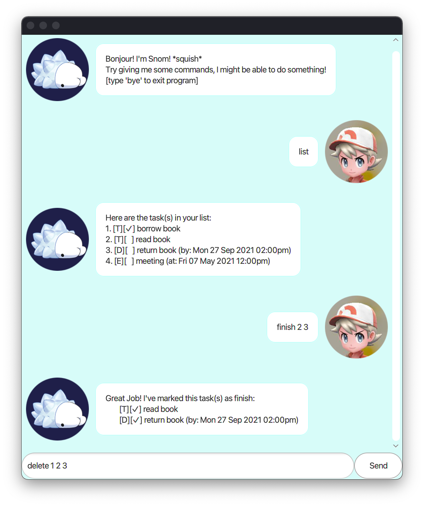

# Snom User Guide
Snom is a Personal Assistant Chatbot that helps a person to keep track of various things.

## Quick Start
1. Ensure you have Java 11 or above installed on your Computer
2. Download the latest Snom.jar from [here](https://github.com/Sharptail/ip/releases).
3. Copy Snom.jar to the folder you want to use as home folder for your Snom.
4. Double-click on Snom.jar to start the application.  

   
5. Type in the command in the command box and press Enter to execute it.
6. Refer to the features below for details of each command.

--------------------------------------------------------------------------------------------------------------------

## Features

**:information_source: Notes about the command format:** 

* Words in `UPPER_CASE` are the parameters to be supplied by the user. 
  e.g. in `todo DESCRIPTION`, `DESCRIPTION` is a parameter which can be used as `todo Borrow Book`.

* Items in square brackets are optional. 
  e.g `deadline DESCRIPTION /at DATE [TIME]` can be used as 
  `deadline Return Book /at 2021-09-27 15:00` or as 
  `deadline Return Book /at 2021-09-27`.

* Items with `…`​ after them can be used multiple time. 
  e.g. `delete …​` can be used as `delete 1 2 3` etc.

* Extraneous parameters for commands that do not take in parameters 
  (such as `list` and `bye`) will be ignored. 
  e.g. if the command specifies `list 123`, it will be interpreted as `list`.

### Help : `help`

Shows a list of commands with description. 
Use `help COMMAND` for more information on specific command.

Format: `help` or `help COMMAND`  
Example: `help deadline`

### Adding a task: `todo` `deadline` `event`

Adds a task into task list.

Format: 
- `todo DESCRIPTION`
- `deadline DESCRIPTION /by DATE [TIME]`
- `event DESCRIPTION /at DATE [TIME]`

Examples:
- `todo Borrow Book`
- `deadline Return Book /by 2021-09-27`
- `event Meeting /at 2021-05-07 15:00`

### Listing all persons : `list`

Shows a list of all task in the task list.

Format: `list`

### Search for task(s) in the task list: `find`

Find tasks contain any of the given keywords.

Format: `find KEYWORD` 
Example: `find book

### Mark a task as finished : `finish`

Marks one or more tasks as finished.

Format: `finish ...`

Example: `finish 1 2 3`

### Deleting a task : `delete`

Deletes one or more tasks from the task list.

Format: `delete ...`

Examples: `delete 1 2 3`

### Exiting the program : `bye`

Exits the program.

Format: `bye`

### Saving the data

Snom data are saved in the hard disk automatically after any command that changes the data. 
There is no need to save manually.

--------------------------------------------------------------------------------------------------------------------

## FAQ

**Q**: How do I transfer my data to another Computer? 
**A**: Install the app in the other computer and overwrite the empty data file 
it creates with the file that contains the data of your previous Snom home folder.

--------------------------------------------------------------------------------------------------------------------

## Command summary

Action | Format
--------|------------------
**todo** | `todo DESCRIPTION`
**deadline** | `deadline DESCRIPTION /by DATE [TIME]`
**event** | `event DESCRIPTION /at DATE [TIME]`
**list** | `list`
**find** | `find KEYWORD`
**finish** | `finish ...`
**delete** | `delete ...`
**bye** | `bye`